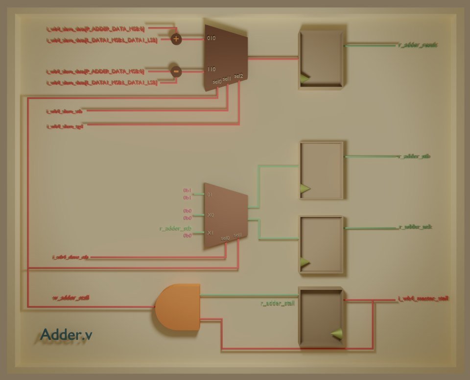
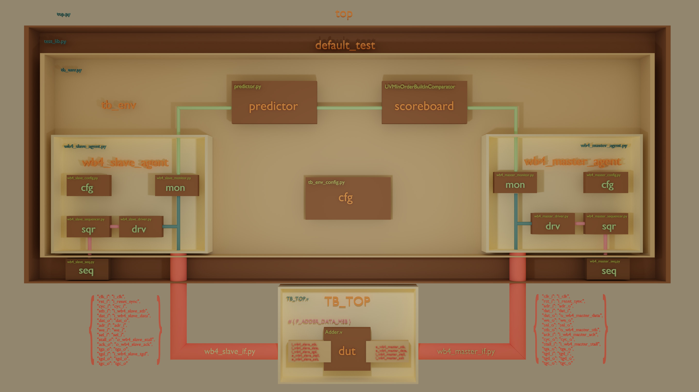

# Adder Register-Transfer Level Specification

Document Metadata | Log
:---------------- | :------------------
_Version_         | v1.0.0
_Prepared by_     | Jose R Garcia
_Project_         | Adder

## 1 Abstract

A unit capable of performing addition or subtraction over the input data.

## 2 Table Of Contents

- [Adder Register-Transfer Level Specification](#adder-register-transfer-level-specification)
  - [1 Abstract](#1-abstract)
  - [2 Table Of Contents](#2-table-of-contents)
  - [3 Syntax and Abbreviations](#3-syntax-and-abbreviations)
  - [4 Design Overview](#4-design-overview)
  - [5 Configurable Parameters](#5-configurable-parameters)
  - [6 Clocks and Resets](#6-clocks-and-resets)
  - [7 Interfaces](#7-interfaces)
    - [7.1 Wishbone Pipeline Slave Interface](#71-wishbone-pipeline-slave-interface)
    - [7.2 Wishbone Pipeline Master Interface](#72-wishbone-pipeline-master-interface)
  - [8 Memory Map](#8-memory-map)
  - [9 Test Bench and Simulation](#9-test-bench-and-simulation)
    - [9.1 Test Bench](#91-test-bench)
      - [9.1.1 Predictor Model](#911-predictor-model)
      - [9.1.2 Functional Coverage](#912-functional-coverage)
      - [9.1.3 Tests Cases and Procedures](#913-tests-cases-and-procedures)
    - [9.2 Simulation](#92-simulation)
      - [9.2.1 Prerequisites](#921-prerequisites)
      - [9.2.2 Execution](#922-execution)

## 3 Syntax and Abbreviations

Term        | Definition
:---------- | :---------------------------
0b0         | Binary number syntax
0x0000_0000 | Hexadecimal number syntax
bit         | Single binary digit (0 or 1)
BYTE        | 8-bits wide data unit
DWORD       | 32-bits wide data unit
LSB         | Least Significant bit
MSB         | Most Significant bit
WB          | Wishbone Interface
WB3         | Wishbone Standard Interface
WB4         | Wishbone Pipeline Interface
WORD        | 16-bits wide data unit

## 4 Design Overview

This modules creates a pipelined adder. The every valid input data contains both factors for the operation. The upper half of the data bits represent factor1, the lower half represents factor0. The operation performed is over the valid data is indicated by the data tag signal. When the data tag signal is '0' the operation corresponds to the addition of factor0 and factor1. When the data tag is '1' the operation corresponds to subtracting factor1 of factor0 (factor0 - factor1). The resulting data is available on the next clock on the output data signal.

If the recipient of the output data asserts the stall signal to apply back pressure this will cause the input interface to apply back pressure by asserting the stall signal on the next clock cycle. This module does not provide any buffering or memory to maintain constant flow of data in the output interface is available at a slower rate than the input. Hence every output data must be offloaded from this module at the same rate or faster than the rate at which data is received.

| 
| :--------------------------------------------------------:
| Figure 1 : Adder Logic Design Diagram

## 5 Configurable Parameters

| Parameters         | Default | Description
| :----------------- | :-----: | :-----------------------------------------------------------------------------------------------
| `P_ADDER_DATA_MSB` |    0    | Results most significant bit. The input data vector MSB is calculated of this parameter as well.
## 6 Clocks and Resets

| Signals        | Initial State | Direction | Definition
| :------------- | :-----------: | :-------: | :--------------------------------------------------------------------
| `i_clk`        |      N/A      |    In     | Input clock. Streaming interface fall within the domain of this clock
| `i_reset_sync` |      N/A      |    In     | Reset signal synchronous to `i_clk`. Used to reset this unit.

## 7 Interfaces

This section lists all the interfaces and their signals used in the data flow and/or configuration access.

### 7.1 Wishbone Pipeline Slave Interface

| Signals             | Reset State  | Dimensions                   | Direction | Definition
| :------------------ | :---------:  | :--------------------------: | :-------: | :------------------------------------------------------------------------
| `i_wb4_slave_stb`   |      N/A     |             1-bit            |    In     | Start indicator.
| `i_wb4_slave_data`  |      N/A     | [(`P_ADDER_DATA_MSB`*2)+1:0] |    In     | Result destination address.
| `i_wb4_slave_tgd`   |      N/A     |             [1:0]            |    In     | Indicates the calculation to perform. 0=addition, 1=substract.
| `o_wb4_slave_stall` |      0b1     |             1-bit            |    Out    | Stall signal used to apply back pressure to the pipeline when set to '1'.
| `o_wb4_slave_ack`   |      0b0     |             1-bit            |    Out    | When '1' indicates a strobe got acknowledged.

### 7.2 Wishbone Pipeline Master Interface

| Signals              | Reset State | Dimensions             | Direction | Definition
| :------------------- | :---------: | :--------------------: | :-------: | :----------------------------------------------------------------
| `o_wb4_master_stb`   |     0b0     |          1-bit         |    Out    | Output strobe used to indicate a valid result in the data signal.
| `o_wb4_master_data`  |     0x0     | [`P_ADDER_DATA_MSB`:0] |    Out    | Result of the operation.
| `i_wb4_master_stall` |     N/A     |          1-bit         |    In     | Back pressure applied to this module. 
| `i_wb4_master_ack `  |     N/A     |          1-bit         |    In     | Response, acknowledge to the strobe assertion.

## 8 Memory Map

N/A

## 9 Test Bench and Simulation

### 9.1 Test Bench

This is a UVM test bench is written in python using uvm-python. A Wishbone Slave verification agent stimulates the DUT by sending factors for the DUT to provide the division result. A Wishbone Master verification agent is used as a monitor to capture the result. A predictor sees the Wishbone Slave transactions and consequently generates Wishbone Master transactions to compare against the response generated by the DUT. The comparison is performed byt the scoreboard component which keeps tracks of the matches and mismatches. A single mismatch is sufficient to consider the test a failure.

| 
| :--------------------------------------------------------:
| Figure 2 : Test Bench Diagram

#### 9.1.1 Predictor Model

The predictor receives the transactions observed by the WB4 Slave Agent Monitor. The data field in these transactions is of integer type, therefore the predictor process the data to separte each factor. To separate each factor from the data, the data is converted from `int` to `hex`. The LSBs of the lower half are used to create factor0, while the remaning MSBs are used to create factor1. Both factor0 and factor1 are then converted to `int` type. The predictor then looks at the data tag; if the data tag is 0 then it generates the sum of factor0 and factor1, if the data tag is 1 then it substract factor1 from factor0. These results are used as the data for a response transaction that is sent to the scorebard to be compared against the transactions observed against the WB4 Master Agent Monitor. 

#### 9.1.2 Functional Coverage

The the coverpoints of interest for this module lay in `i_wb4_slave_tgd` and `i_wb4_master_stall` signals.

#### 9.1.3 Tests Cases and Procedures

**Test Cases and their descriptions:**

| Case          | Description
| :------------ | :----------
| `pipeline`    | Tests the Wishbone Pipeline interfaces to be compliant.
| `stall`       | Stall signal is asserted in the master bus and expected to flow up to the slave bus.
| `addition`    | valid data is received and data tag contains a '0'. The result (master's output data) is expected to be the sum of factor1 and factor0.
| `subtraction` | valid data is received and data tag contains a '1'. The result (master's output data) is expected to be the sum of factor0 minus factor1.
| `overflow`    | Conditions where the sum of factor0 and factor1 requires more bits than `P_ADDER_DATA_MSB`+1 to be represented accurately.

**Test Procedures and their descriptions:**

| Name         | Procedure                                                                                                                                                                          | Case(s)
| :----------- | :--------------------------------------------------------------------------------------------------------------------------------------------------------------------------------- | :--------------------------------------
| default_test | Input data counts down every clock until the end of the simulation. The master interface will apply back pressure to the second transaction and will release the stall afterwards. | `pipeline`, `stall`, `overflow`, `addition`.
| subtract_test | Input data counts up every clock until the end of the simulation.                                                                                                                 | `subtraction`, `pipeline`

### 9.2 Simulation

This sections cover the requisites and commands for executing the simulation.

#### 9.2.1 Prerequisites

 - Verilator (**v4.106**)
 - cocotb (1.5 or higher)
 - cocotb-coverage (optional)
 - uvm-python
 - gtkwave(optional)

To install a simulator follow the instructions in in the verilator website.
For setting cocotb and uvm-python:

    sudo apt install python3-pip
    pip install cocotb
    pip install cocotb-coverage
    git clone https://github.com/tpoikela/uvm-python.git
    cd uvm-python
    python -m pip install --user .

#### 9.2.2 Execution

From the sim/ directory run the command

    make

This will run the default test for this module. To view the wave form open the file `wave.gtkw` with gtkwave after the test has ended.
